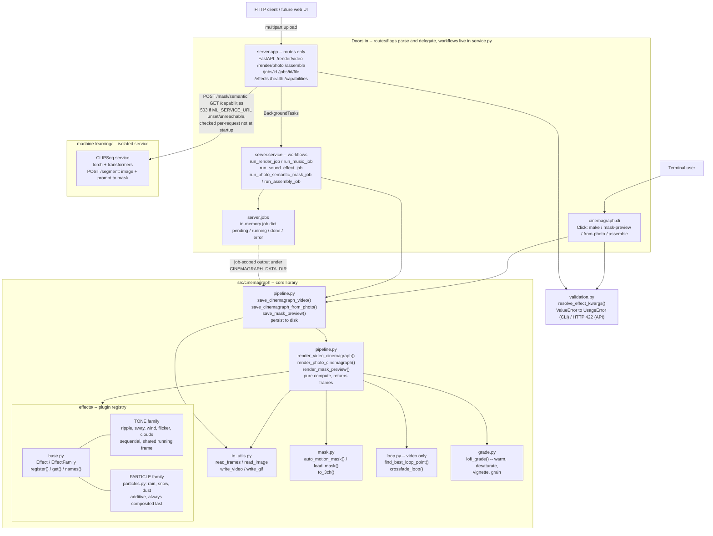

# cinemagraph

Make looping lofi video: freeze a background, keep one element moving. Start from a short video
clip, or from a single still photo animated with built-in procedural effects — rain, snow, dust,
ripple, sway, wind, flicker, smoke, vapor — with no source footage at all.

It optionally also generates the music, the sound effects, and the images to animate, and
assembles finished clips into long-form video. Those parts are opt-in: they run as separate
containers with their own models, and everything else works without them.

Usable from the command line or from a local web UI.

## Quick start

No Docker, no GPU, no API keys. This is the whole install:

```bash
uv sync
uv run cinemagraph from-photo photo.jpg output.mp4 --effect smoke
```

`photo.jpg` is checked in, so that second line runs verbatim on a fresh clone. Uses
[uv](https://docs.astral.sh/uv/).

## What needs what

| Feature | Requires |
|---|---|
| Photo → looping video, 9 effects | nothing |
| Video clip → cinemagraph | nothing |
| Asset library, long-form assembly | nothing |
| Web UI | `bun run build` once, or Docker |
| Semantic masking ("animate just the water") | `machine-learning` container |
| Image generation | `image-generation` container + GPU, or a Gemini API key |
| Music | `acestep` container + GPU, or a Gemini API key |
| Sound effects | `sound-effects` container + GPU |

Anything unavailable degrades rather than breaks: the API reports it as unavailable, the web UI
hides or annotates that tab, and every other feature keeps working. Nothing is checked at startup,
so a missing service can never stop the app from booting.

Copy `.env.example` to `.env` before enabling any of the optional pieces — it documents every
variable, including the Hugging Face license acceptance that `sound-effects` needs.

To see the state of all of it at once:

```bash
uv run cinemagraph doctor
```

It reports what's configured, what's actually reachable, and what to run to fix anything that
isn't — including whether a satellite is loaded, idle, or stuck on a wedged request. Optional
services being off is reported as off, not as a problem; it exits non-zero only when something is
genuinely broken, so it also works as a deploy gate.

## Before you put this on a network

There is **no authentication**. Anyone who can reach the port can use every endpoint, read your
entire asset library, and spend your GPU. Job state lives in process memory and is lost on
restart, and job directories are not cleaned up automatically.

This is a deliberate design for a personal, single-user, local tool — not an oversight (see
`docs/DESIGN.md`). Run it on localhost, or behind something that does the authenticating. It is
not built to face the internet.

## Setup

Uses [uv](https://docs.astral.sh/uv/) for dependency management and running:

```bash
uv sync
```

This creates `.venv` and installs everything from `pyproject.toml`/`uv.lock`. Run commands with `uv run ...` (shown below), or activate `.venv` and drop the `uv run` prefix if you prefer.

## From a single photo (no video needed)

Animate a still photo with a procedural effect — motion is generated algorithmically, no source footage required:

```bash
uv run cinemagraph from-photo photo.jpg output.mp4 --effect smoke
```

Available effects: `rain`, `snow`, `dust`, `ripple`, `sway`, `wind`, `flicker`, `smoke`, `vapor`.

Effects can be combined by repeating `--effect` (any mix of particle effects like `rain`/`snow`/`dust` and tone effects like `wind`/`smoke`):

```bash
uv run cinemagraph from-photo photo.jpg output.mp4 --effect wind --effect vapor --effect dust
```

By default the effect applies over the whole photo. To restrict it to one area (e.g. only the window, only the candle), supply a mask PNG (white = animated, black = frozen) — paint one by hand in any image editor:

```bash
uv run cinemagraph from-photo photo.jpg output.mp4 --effect rain --mask window_mask.png
```

Useful flags: `--duration` (seconds), `--fps`, `--feather` (mask edge softness), `--no-grade`, `--grade-strength`, `--grain`, `--gif`.

These loop perfectly by construction (the motion is a periodic function of time), so there's no crossfading step needed like the video pipeline below.

## From a video clip

Auto-detect the moving region (steam, rain, hair, etc.) and produce a looping, lofi-graded cinemagraph:

```bash
uv run cinemagraph make input.mp4 output.mp4
```

Preview the auto-detected mask before committing to a full render (useful for tuning):

```bash
uv run cinemagraph mask-preview input.mp4 mask_preview.png
```

Open `mask_preview.png` in an image editor, touch it up if needed (white = keeps moving, black = frozen), then use it directly:

```bash
uv run cinemagraph make input.mp4 output.mp4 --mask mask_preview.png
```

Useful flags:

| Flag | What it does |
|---|---|
| `--still-frame N` | which frame becomes the frozen background |
| `--blend-frames N` | how many frames are crossfaded to make the loop seamless |
| `--mask-threshold N` | sensitivity of auto motion detection (lower = more sensitive) |
| `--feather N` | softness of the mask edges (avoids a "cutout" look) |
| `--no-grade` | skip the lofi color grade, keep original colors |
| `--grade-strength X` | intensity of the warm/faded/desaturated grade |
| `--grain X` | film grain amount, 0 to disable |
| `--gif` | also export a `.gif` next to the `.mp4` |
| `--save-mask path.png` | save the mask used, for inspection |

## How the photo effects work

Each effect (`src/cinemagraph/effects/`, one module per effect, registered in `base.py`) drives motion with a periodic function of `t = frame / total_frames`, so frame 0 and the "next" frame after the last one line up automatically:

- **rain / snow / dust** — particle systems with different speed, size, direction, and opacity presets. Any number can be combined, and they always composite on top of whatever else is applied.
- **ripple** — sine-wave pixel displacement (`cv2.remap`) for water-like distortion.
- **sway** — the same displacement technique but horizontal and height-dependent, for swaying branches/leaves.
- **wind** — several sway-like displacement octaves at different spatial/temporal rates summed together, for a turbulent, gusting look rather than a single uniform sway.
- **flicker** — brightness modulated by a sum of sine harmonics, for candle/fire light.
- **smoke / vapor** — share a layered-sine-field "cloud" engine; `vapor` adds blur, lower opacity, and a deterministic rising carrier wave for a steam/mist look, vs. smoke's denser in-place turbulence.

## How the video pipeline works

1. Reads all frames of the input clip.
2. Auto-trims the clip to the point where it loops most naturally (or use the full clip with `--no-auto-trim`).
3. Picks one frame as the frozen background.
4. Builds a soft mask of the moving region — either automatically (frame-differencing + largest connected motion blob + feathering) or from a hand-painted PNG you supply.
5. Composites: frozen background everywhere the mask is black, live video where it's white.
6. Crossfades the last few frames into the first few so the loop point is invisible.
7. Applies a warm, desaturated, lifted-black, grainy "lofi" grade (optional).
8. Exports MP4 (and optionally GIF).

## Tips for good source footage

- Use a tripod — any camera shake breaks the "frozen" illusion.
- Pick one small, naturally cyclical motion: steam, rain on glass, a spinning record, a candle flame, swaying leaves.
- A shot that returns close to its starting position (rotational/oscillating motion) loops far more convincingly than one that doesn't.
- 4-8 seconds of footage is usually enough.

## Testing without your own footage

`examples/make_test_clip.py` generates a synthetic clip (a mug with rising "steam") to try the video pipeline:

```bash
uv run python examples/make_test_clip.py
uv run cinemagraph make examples/test_input.mp4 examples/test_output.mp4 --gif
```

`examples/make_test_photo.py` generates a synthetic photo to try the photo effects:

```bash
uv run python examples/make_test_photo.py
uv run cinemagraph from-photo examples/test_photo.jpg examples/test_output.mp4 --effect smoke
```

## Automated tests

```bash
uv run pytest
```

Covers the mask contract (`auto_motion_mask`/`load_mask`/`to_3ch`), the effect registry (loop-closure
invariant, per-effect kwarg validation), the reference library, and end-to-end smoke tests for both
pipelines and the API — all against synthetic fixtures generated on the fly, no checked-in test assets
required.

Separately, `scripts/golden_check.py` catches "the refactor silently changed the rendered pixels" —
a regression class the tests above deliberately don't check (they verify output is *valid*, not that
it matches previous output):

```bash
uv run python scripts/golden_check.py            # check against tests/golden/
uv run python scripts/golden_check.py --bless     # (re)generate the blessed frames
```

See `docs/DESIGN.md` for why this is a separate script rather than a pytest test.

`tests/integration/` is a third category: real requests against an already-deployed,
live stack (a real GPU, real generation, real minutes), not synthetic fixtures. Excluded
from the plain `uv run pytest` above; run it explicitly once the stack is up:

```bash
docker compose --profile audio up -d acestep core
uv run pytest -m integration
```

Or bundle the whole up/wait/test/teardown cycle into one command:

```bash
uv run python scripts/verify_music_deploy.py
```

Currently covers music generation only. See `docs/DESIGN.md` sec 3.7/5.9 for why these
exist, why there's no dedicated test container, and why they aren't part of CI.

## API and web UI

A minimal local HTTP API (FastAPI) wraps the same rendering code, for a UI or scripted use without
shelling out. A self-contained web UI ships too — `GET /` serves a single HTML page (inline CSS/JS,
no build step) with four tabs: **Photo** and **Video** rendering (upload, effects/mask, submit,
watch it render, preview) are always available; **Music** and **Sound effects** each appear only
when `GET /capabilities` reports that backend as configured, same signal used throughout the rest
of the system to degrade gracefully:

```bash
uv sync --extra server
uv run uvicorn server.app:app --reload
# then open http://127.0.0.1:8000/ in a browser
```

`POST /render/video` / `POST /render/photo` accept a multipart file upload and return a `job_id`
immediately (renders run in the background); `GET /jobs/{job_id}` polls status, `GET /jobs/{job_id}/file`
downloads the result once done. `GET /effects` lists available effects, `GET /capabilities` reports
optional features. No auth — this is meant for local/personal use, not as a hosted service.

Four routes proxy to optional external services, all degrading to a clean `503` (never a `500`, never
blocking startup) whenever the service isn't configured or isn't reachable:

- **`POST /mask/semantic`** — semantic masking (`image`, `prompt` form fields) via
  `machine-learning/`, a small FastAPI wrapper around CLIPSeg (loaded via `transformers`) that
  ships with this repo (own `pyproject.toml`/`Dockerfile`, isolated from the core's
  dependencies — see that directory's README). Configure with `ML_SERVICE_URL`;
  `docker compose --profile ml up machine-learning` runs it locally. `POST /render/photo`'s
  `mask_prompt` field chains this straight into a render:

  ```bash
  curl -X POST http://localhost:8000/render/photo \
    -F "input_file=@photo.jpg" -F "effect=wind" -F "mask_prompt=clouds"
  ```

  One request instead of segment-save-then-render by hand. The generated mask is kept in the
  job directory so a disappointing result can be inspected. If the service is unavailable the
  job fails rather than silently rendering unmasked. No CLI equivalent — see `docs/DESIGN.md`.
- **`POST /generate/music`** — music generation via an [ACE-Step](https://github.com/ace-step/ACE-Step)
  API server (`prompt`, `lyrics`, `duration`, `thinking`, `instrumental` form fields). ACE-Step already
  ships its own server — nothing to build, just point at a running instance. Its API is itself a job
  queue, so this route drives it to completion in the background and reuses the *same*
  `GET /jobs/{job_id}` / `GET /jobs/{job_id}/file` you'd use for a render. Configure with
  `ACESTEP_URL`. `instrumental=true` overrides `lyrics` with ACE-Step's own instrumental marker
  (`"[Instrumental]"`) rather than relying on an empty `lyrics` field, which ACE-Step's real server
  does *not* treat as instrumental on its own.
- **`POST /generate/sound-effect`** — ambient/SFX generation (`prompt`, `duration` form fields) via
  `sound-effects/`, a small FastAPI wrapper around Stable Audio Open that ships with this repo (own
  `pyproject.toml`/`Dockerfile`, isolated from the core's dependencies — see that directory's README).
  Configure with `SOUND_EFFECTS_URL`; `docker compose --profile audio up sound-effects` runs it
  locally. Validated end-to-end against a real GPU — see `docs/experiments/`.
- **`POST /generate/image`** — image generation (`prompt` form field, plus optional
  `reference_image` upload + `strength` for img2img, plus optional `model`) behind an
  `ImageGenerator` port with two coexisting adapters (`server/generation_ports.py`/
  `generation_adapters.py`/`generation_registry.py`, see `docs/DESIGN.md` sec 3.6):
  - `model=sdxl` (default) — `image-generation/`, a small FastAPI wrapper around Stable
    Diffusion XL that ships with this repo (own `pyproject.toml`/`Dockerfile`, isolated from the
    core's dependencies — see that directory's README). Configure with `IMAGE_GENERATION_URL`;
    `docker compose --profile image up image-generation` runs it locally. img2img is
    best-effort on this project's 8GB GPU (a real, accepted VRAM tradeoff — see
    `image-generation/README.md`).
  - `model=gemini` — Google's hosted Gemini image API (`generation/`, a light sibling module,
    `google-genai` via the root `generation` extra — `uv sync --extra server --extra
    generation`). Configure with `GEMINI_API_KEY`. No `strength` equivalent (accepted and
    ignored). Requires Google AI Studio's paid tier (non-refundable minimum prepay for new
    accounts) — see `docs/experiments/` for the full account of the first, reverted attempt and
    the later one that actually adopted it.

  `GET /capabilities`'s `image_generation_models` lists every currently-registered adapter (the
  web UI's model dropdown only appears once more than one is); `image_generation` itself is
  `true` if either SDXL health-checks or Gemini is configured. Validated end-to-end against a
  real GPU (SDXL) and the real API (Gemini) — see `docs/experiments/`.

Two more routes don't proxy to an optional external service — they're purely local work:

- **`POST /assemble`** — long-form assembly (`docs/DESIGN.md` sec 5.6): combines already-generated
  library assets into one finished video via `src/assembly/` (its own top-level package, driving
  `ffmpeg` — bundled via `imageio-ffmpeg`, already a dependency — directly through `subprocess`).
  `clip_asset_ids`/`music_asset_ids` (required) and `sound_effect_asset_ids` (optional) are asset
  IDs, resolved via the library; video clips are concatenated with crossfades (`xfade`), music
  tracks are concatenated with crossfades (`acrossfade`) plus a fade-in/out at the whole track's
  edges (`afade`), sound effects are layered continuously under the music (`amix`), and the two
  finished tracks are muxed together. Same CLI equivalent: `cinemagraph assemble CLIP_PATHS...
  OUTPUT_PATH --music ... [--sound-effect ...]`. Registers output as `kind="generated",
  tags=["assembled"]`. Verified against real ffmpeg twice (synthetic filter-syntax checks, then
  the real CLI against real `cinemagraph`-rendered clips) — see `docs/experiments/`.

## Reference library

A persistent local store for source images/videos and generated outputs, so they can be found again
later instead of being forgotten the moment a render finishes. Files are content-addressed (SHA-256 —
adding the same file twice is a free no-op on disk) with metadata in a small SQLite index.

```bash
uv run cinemagraph library add photo.jpg --kind reference --tag sky --tag concept
uv run cinemagraph library list --tag sky
uv run cinemagraph library show <asset-id>
uv run cinemagraph library rm <asset-id>
```

Storage location defaults to `~/.cinemagraph/library`, override with `CINEMAGRAPH_LIBRARY_DIR`. The
same operations are available over the API: `POST /library`, `GET /library`, `GET /library/{id}`,
`GET /library/{id}/file`, `DELETE /library/{id}`.

The API's render/generate routes (`/render/photo`, `/render/video`, `/generate/music`,
`/generate/sound-effect`) auto-register their output here once a job finishes. The CLI's
`make`/`from-photo` deliberately don't -- their output path is one you already chose and control, so
`library add` above is there for when you want to catalog something on purpose, without every draft
render while tuning a mask or effect getting swept in automatically.

## Docker

```bash
docker compose up
```

Builds and runs the API on `localhost:8000`, with `./data` mounted for job input/output *and* for the
asset library (`CINEMAGRAPH_LIBRARY_DIR=/data/library`, pointed at a subdirectory of the same mount --
without this, the library defaults to a path inside the container's own throwaway filesystem, so it'd
survive a `restart` but be silently wiped by `docker compose down` + `up`, defeating the point of a
*persistent* library). The image only ever includes the `server` extra (opencv/numpy/click/fastapi) —
never `torch`/`transformers`, which live only in the optional, separately-built `sound-effects`,
`machine-learning`, and `image-generation` services, plus `acestep` (ACE-Step's own published
image, not built by this repo):

```bash
docker compose --profile audio up      # core + sound-effects (Stable Audio Open) + acestep (ACE-Step music)
docker compose --profile ml up         # core + machine-learning (CLIPSeg)
docker compose --profile image up      # core + image-generation (Stable Diffusion XL)
```

**What each one costs you.** These are measured on this project's own hardware, not estimates. The
weights download on first use and are cached in a named volume afterwards:

| Service | Profile | First-run download | VRAM while loaded |
|---|---|---|---|
| `machine-learning` (CLIPSeg) | `ml` | ~577 MB | runs on CPU here |
| `sound-effects` (Stable Audio Open) | `audio` | ~5.4 GB | GPU strongly preferred |
| `image-generation` (SDXL) | `image` | ~14 GB | ~147 MiB with `CPU_OFFLOAD=1`, ~7.1 GB without |
| `acestep` (ACE-Step) | `audio` | ~11 GB | needs ~8 GB |

On a single 8 GB card these are effectively **mutually exclusive**, which is why each unloads its
model after `MODEL_TTL` seconds idle and they take turns rather than fighting. Running two profiles
at once on one GPU will work, slowly, as they swap. See each service's README under "Model
lifecycle", and `docs/experiments/2026-08-21-model-lifecycle-prior-art.md` for why it works this way.

`sound-effects` additionally needs `HF_TOKEN` **and** a license acceptance on the model's Hugging
Face page — see `.env.example`.

`acestep` downloads its own ~11GB of checkpoints into `./data/acestep-checkpoints` on first run,
cached across restarts same as the other services. If you'd rather run ACE-Step natively on the
host instead (e.g. you already have a checkout with its own downloaded checkpoints), see the
commented `ACESTEP_URL=http://host.docker.internal:8001` alternative in `docker-compose.yml` —
bind-mounting an existing checkout's checkpoints directly into the container is not recommended,
it's known to hang under Docker Desktop's WSL2 file sharing (see `docs/experiments/`).

The CLI works the same way inside the container, overriding the default command:

```bash
docker run --rm -v "$(pwd)/data:/data" cinemagraph cinemagraph from-photo /data/photo.jpg /data/out.mp4 --effect smoke
```

### Live development: Compose Watch

```bash
docker compose up --watch core
```

Use `up --watch`, not the standalone `docker compose watch core` — that command only prints
sync/rebuild status messages, not the container's own application logs (a known, documented Compose
limitation, confirmed against a real `docker/compose` GitHub issue and reproduced directly: the
container was clearly handling requests, but `docker compose watch` alone showed nothing from it).
`up --watch` gets the identical auto-sync/auto-restart behavior while also attaching and streaming
the container's logs, exactly like plain `docker compose up`.

Docker Compose's own officially documented live-development mechanism
(docs.docker.com/compose/how-tos/file-watch/), configured in `docker-compose.override.yml`. Editing
anything under `src/` automatically syncs the change into the running container and restarts it —
no manual rebuild, no manual restart. Editing `pyproject.toml`/`uv.lock` automatically rebuilds the
image instead, since a dependency change can't take effect without one.

Two earlier approaches were tried and reverted before landing here — both are recorded in
`docs/experiments/2026-07-28-docker-dev-reload.md`:

1. A bind mount + `uvicorn --reload`. Reverted after a real crash: `--reload`'s file-watcher
   (`watchfiles`, a Rust extension) runs *inside* the container's own process, and it crashed with
   `Cannot allocate memory` under the memory pressure of a real render, taking the whole server down
   with it — discovered through actual use, not testing.
2. A bind mount with `--reload` removed (source edits needed a manual `docker compose restart core`).
   Safe, but manual.

Compose Watch supersedes both: its file-watching runs on the **host**, via the Compose CLI itself,
never inside the container — so there's no in-container watcher process left to crash under
render-induced memory pressure, while still getting fully automatic reload. Verified directly:
reproduced the exact scenario that crashed the old `--reload` setup (rendering a large real photo
while watching container memory climb to 3.7GB+) with `docker compose watch` running, and the
container stayed healthy throughout with no restart, no crash, no `WatchfilesRustInternalError`.
Also verified a plain source edit (`server/ui.py`'s `<title>`) auto-synced and auto-restarted with
no command needed beyond the edit itself. (That crash-reproduction and the auto-sync check were run
against the standalone `docker compose watch` command; `up --watch` uses the identical underlying
watch mechanism, just with logs attached, so the same crash-avoidance applies -- confirmed separately
that `up --watch` does attach and stream logs correctly.)

Only covers `core` — `machine-learning`/`sound-effects` carry heavy, slow-to-rebuild dependencies and
are edited far less often; add an equivalent `develop.watch` block there too if that changes.

## Architecture

Both doors (CLI, API) sit on the same core library — neither duplicates rendering logic. The CLI
calls `pipeline.py`'s `save_*` (persist-to-disk) side synchronously. The API delegates to
`server/service.py`, which calls the same `save_*` functions inside a background job, so the route can
return a `job_id` immediately instead of blocking the HTTP connection for the whole render.

The `render_*` (pure-compute, returns frames) half of the compute/persist split is used today by
`scripts/golden_check.py` and the pipeline tests, which genuinely need frames rather than files —
not by the API, which is happy writing into its job directory. The split still earns its keep, just
for a different consumer than originally predicted.



And the deployment view — how those same components map onto containers:


Key design decisions this reflects:

- **One rendering engine, two doors in.** The CLI (synchronous) and the API (background job) never
  fork the actual rendering logic — both bottom out in the same `pipeline.py` functions.
- **Routes don't hold workflows.** `server/app.py` parses and delegates; `server/service.py` holds the
  multi-step work, including the only code that knows about *both* external services and the render
  pipeline. That keeps the core library ignorant of HTTP and makes the workflows unit-testable
  without an HTTP round-trip.
- **One effect registry, not five parallel structures.** Every effect (tone or particle) registers
  itself once in `base.py`; `animate_photo()` (inside `effects/`) resolves requested effects against
  that registry and always runs tone effects before particle effects, regardless of request order.
- **`validation.py` is genuinely shared now.** Both `cli.py`'s `from-photo` and `server/app.py`'s
  `POST /render/photo` call the same `resolve_effect_kwargs()`, translating its plain `ValueError`
  into `click.UsageError` on one side and HTTP 422 on the other — one source of truth, two error
  shapes, not two separate implementations that happen to agree. The unknown-effect check is still
  separate, hand-rolled logic on both sides (it's a one-line membership test, not worth a shared
  function for).
- **The `machine-learning` service (CLIPSeg) is built and validated**, not just a reserved seam
  (named to match [Immich](https://github.com/immich-app/immich/tree/main/machine-learning)'s
  convention for this same shape of split). The core image never depends on `torch`/`transformers`;
  `server/app.py` checks for the service at request time and degrades to a clean `503` when it's absent,
  so the core tool is never blocked when the optional service isn't running.

## Licensing

This project's own code is licensed under the **Apache License 2.0** — see [`LICENSE`](LICENSE).
Apache-2.0 rather than MIT for its explicit patent grant (§3), which matters in diffusion-model and
video-codec territory, and for the contribution terms in §5 that make a pull request's licensing
unambiguous without a CLA.

**That license covers this repository's code, and nothing else.** The optional satellite services
download model weights at runtime, and those weights — plus, depending on the model, what you
generate with them — carry their own separate terms:

| Model | Used by | Terms to check before you rely on the output |
|---|---|---|
| Stable Diffusion XL | `image-generation/` | CreativeML OpenRAIL++-M — a *use-restricted* license, not a permissive one |
| Stable Audio Open | `sound-effects/` | Stability's own community license, and the HF repo is **gated** |
| CLIPSeg | `machine-learning/` | its own model-card terms |
| ACE-Step | `acestep` (third-party image, not built here) | upstream's terms; this repo only ever references the published image |
| Gemini / Lyria 3 | `generation/` | Google's API terms, if you supply a `GEMINI_API_KEY` |

Two practical consequences:

- **Stable Audio Open is a gated repository.** You must accept its license on the model's Hugging
  Face page with the account behind your `HF_TOKEN`, or the download fails — this is the most
  common first-run failure, and it is not a bug in this tool.
- **Nothing here grants you rights to model outputs.** If you plan to use generated audio, images,
  or video commercially, read the relevant model's license. A permissive license on this code says
  nothing about what SDXL or Stable Audio permit.

Third-party Python dependencies keep their own licenses. Note also that the Docker images bundle an
`ffmpeg` binary (via `imageio-ffmpeg`), whose terms depend on how that build was configured —
worth confirming before redistributing images.
