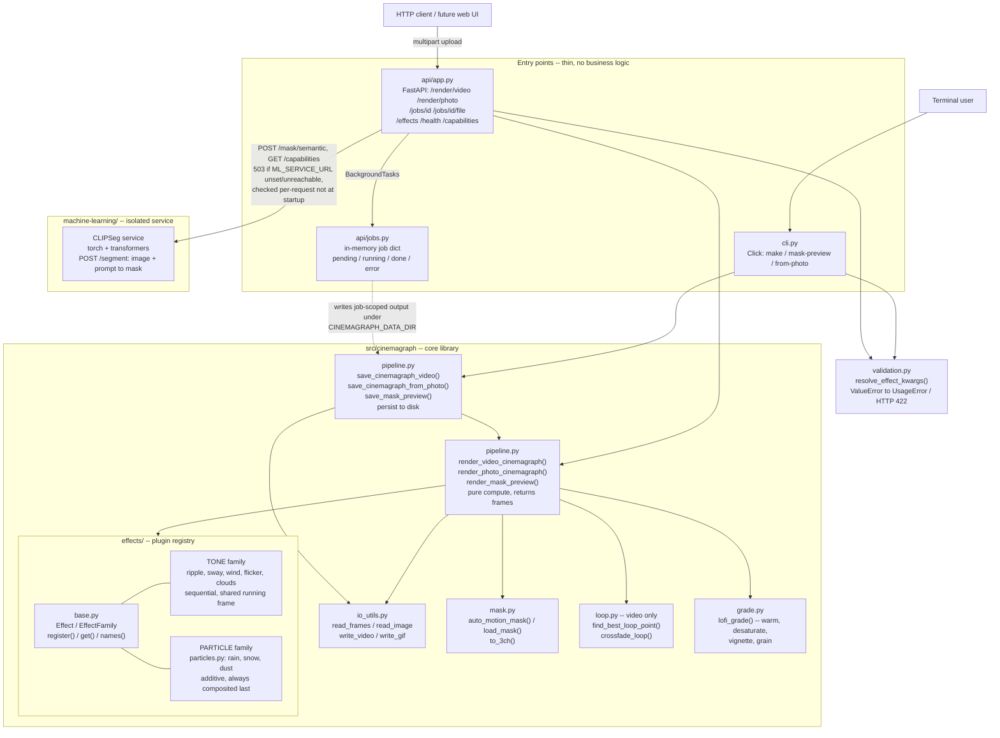
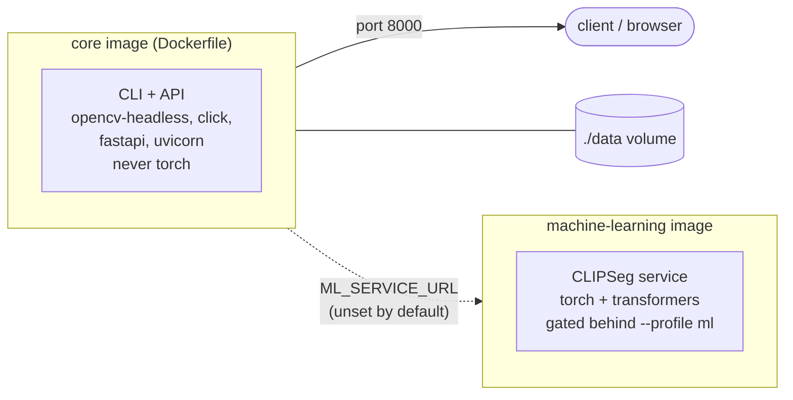

# cinemagraph-tool

Generate lofi-style cinemagraphs (frozen background + one looping moving element), entirely from the command line — either from a short video clip, or from a single still photo using built-in procedural motion effects.

## Setup

Uses [uv](https://docs.astral.sh/uv/) for dependency management and running:

```bash
uv sync
```

This creates `.venv` and installs everything from `pyproject.toml`/`uv.lock`. Run commands with `uv run ...` (shown below), or activate `.venv` and drop the `uv run` prefix if you prefer.

## From a single photo (no video needed)

Animate a still photo with a procedural effect — motion is generated algorithmically, no source footage required:

```bash
uv run cinemagraph from-photo photo.jpg output.mp4 --effect smoke
```

Available effects: `rain`, `snow`, `dust`, `ripple`, `sway`, `wind`, `flicker`, `smoke`, `vapor`.

Effects can be combined by repeating `--effect` (any mix of particle effects like `rain`/`snow`/`dust` and tone effects like `wind`/`smoke`):

```bash
uv run cinemagraph from-photo photo.jpg output.mp4 --effect wind --effect vapor --effect dust
```

By default the effect applies over the whole photo. To restrict it to one area (e.g. only the window, only the candle), supply a mask PNG (white = animated, black = frozen) — paint one by hand in any image editor:

```bash
uv run cinemagraph from-photo photo.jpg output.mp4 --effect rain --mask window_mask.png
```

Useful flags: `--duration` (seconds), `--fps`, `--feather` (mask edge softness), `--no-grade`, `--grade-strength`, `--grain`, `--gif`.

These loop perfectly by construction (the motion is a periodic function of time), so there's no crossfading step needed like the video pipeline below.

## From a video clip

Auto-detect the moving region (steam, rain, hair, etc.) and produce a looping, lofi-graded cinemagraph:

```bash
uv run cinemagraph make input.mp4 output.mp4
```

Preview the auto-detected mask before committing to a full render (useful for tuning):

```bash
uv run cinemagraph mask-preview input.mp4 mask_preview.png
```

Open `mask_preview.png` in an image editor, touch it up if needed (white = keeps moving, black = frozen), then use it directly:

```bash
uv run cinemagraph make input.mp4 output.mp4 --mask mask_preview.png
```

Useful flags:

| Flag | What it does |
|---|---|
| `--still-frame N` | which frame becomes the frozen background |
| `--blend-frames N` | how many frames are crossfaded to make the loop seamless |
| `--mask-threshold N` | sensitivity of auto motion detection (lower = more sensitive) |
| `--feather N` | softness of the mask edges (avoids a "cutout" look) |
| `--no-grade` | skip the lofi color grade, keep original colors |
| `--grade-strength X` | intensity of the warm/faded/desaturated grade |
| `--grain X` | film grain amount, 0 to disable |
| `--gif` | also export a `.gif` next to the `.mp4` |
| `--save-mask path.png` | save the mask used, for inspection |

## How the photo effects work

Each effect (`src/cinemagraph/effects/`, one module per effect, registered in `base.py`) drives motion with a periodic function of `t = frame / total_frames`, so frame 0 and the "next" frame after the last one line up automatically:

- **rain / snow / dust** — particle systems with different speed, size, direction, and opacity presets. Any number can be combined, and they always composite on top of whatever else is applied.
- **ripple** — sine-wave pixel displacement (`cv2.remap`) for water-like distortion.
- **sway** — the same displacement technique but horizontal and height-dependent, for swaying branches/leaves.
- **wind** — several sway-like displacement octaves at different spatial/temporal rates summed together, for a turbulent, gusting look rather than a single uniform sway.
- **flicker** — brightness modulated by a sum of sine harmonics, for candle/fire light.
- **smoke / vapor** — share a layered-sine-field "cloud" engine; `vapor` adds blur, lower opacity, and a deterministic rising carrier wave for a steam/mist look, vs. smoke's denser in-place turbulence.

## How the video pipeline works

1. Reads all frames of the input clip.
2. Auto-trims the clip to the point where it loops most naturally (or use the full clip with `--no-auto-trim`).
3. Picks one frame as the frozen background.
4. Builds a soft mask of the moving region — either automatically (frame-differencing + largest connected motion blob + feathering) or from a hand-painted PNG you supply.
5. Composites: frozen background everywhere the mask is black, live video where it's white.
6. Crossfades the last few frames into the first few so the loop point is invisible.
7. Applies a warm, desaturated, lifted-black, grainy "lofi" grade (optional).
8. Exports MP4 (and optionally GIF).

## Tips for good source footage

- Use a tripod — any camera shake breaks the "frozen" illusion.
- Pick one small, naturally cyclical motion: steam, rain on glass, a spinning record, a candle flame, swaying leaves.
- A shot that returns close to its starting position (rotational/oscillating motion) loops far more convincingly than one that doesn't.
- 4-8 seconds of footage is usually enough.

## Testing without your own footage

`examples/make_test_clip.py` generates a synthetic clip (a mug with rising "steam") to try the video pipeline:

```bash
uv run python examples/make_test_clip.py
uv run cinemagraph make examples/test_input.mp4 examples/test_output.mp4 --gif
```

`examples/make_test_photo.py` generates a synthetic photo to try the photo effects:

```bash
uv run python examples/make_test_photo.py
uv run cinemagraph from-photo examples/test_photo.jpg examples/test_output.mp4 --effect smoke
```

## Automated tests

```bash
uv run pytest
```

Covers the mask contract (`auto_motion_mask`/`load_mask`/`to_3ch`), the effect registry (loop-closure
invariant, per-effect kwarg validation), the reference library, and end-to-end smoke tests for both
pipelines and the API — all against synthetic fixtures generated on the fly, no checked-in test assets
required.

Separately, `scripts/golden_check.py` catches "the refactor silently changed the rendered pixels" —
a regression class the tests above deliberately don't check (they verify output is *valid*, not that
it matches previous output):

```bash
uv run python scripts/golden_check.py            # check against tests/golden/
uv run python scripts/golden_check.py --bless     # (re)generate the blessed frames
```

See `docs/DESIGN.md` for why this is a separate script rather than a pytest test.

## API

A minimal local HTTP API (FastAPI) wraps the same rendering code, for a future UI or scripted use
without shelling out:

```bash
uv sync --extra api
uv run uvicorn api.app:app --reload
```

`POST /render/video` / `POST /render/photo` accept a multipart file upload and return a `job_id`
immediately (renders run in the background); `GET /jobs/{job_id}` polls status, `GET /jobs/{job_id}/file`
downloads the result once done. `GET /effects` lists available effects, `GET /capabilities` reports
optional features. No auth — this is meant for local/personal use, not as a hosted service.

Three routes proxy to optional external services, all degrading to a clean `503` (never a `500`, never
blocking startup) whenever the service isn't configured or isn't reachable:

- **`POST /mask/semantic`** — semantic masking (`image`, `prompt` form fields) via
  `machine-learning/`, a small FastAPI wrapper around CLIPSeg (loaded via `transformers`) that
  ships with this repo (own `pyproject.toml`/`Dockerfile`, isolated from the core's
  dependencies — see that directory's README). Configure with `ML_SERVICE_URL`;
  `docker compose --profile ml up machine-learning` runs it locally.
- **`POST /generate/music`** — music generation via an [ACE-Step](https://github.com/ace-step/ACE-Step)
  API server (`prompt`, `lyrics`, `duration`, `thinking` form fields). ACE-Step already ships its own
  server — nothing to build, just point at a running instance. Its API is itself a job queue, so this
  route drives it to completion in the background and reuses the *same* `GET /jobs/{job_id}` /
  `GET /jobs/{job_id}/file` you'd use for a render. Configure with `ACESTEP_URL`.
- **`POST /generate/sound-effect`** — ambient/SFX generation (`prompt`, `duration` form fields) via
  `sound-effects/`, a small FastAPI wrapper around Stable Audio Open that ships with this repo (own
  `pyproject.toml`/`Dockerfile`, isolated from the core's dependencies — see that directory's README).
  Configure with `SOUND_EFFECTS_URL`; `docker compose --profile audio up sound-effects` runs it
  locally. Validated end-to-end against a real GPU — see `docs/experiments/`.

## Reference library

A persistent local store for source images/videos and generated outputs, so they can be found again
later instead of being forgotten the moment a render finishes. Files are content-addressed (SHA-256 —
adding the same file twice is a free no-op on disk) with metadata in a small SQLite index.

```bash
uv run cinemagraph library add photo.jpg --kind reference --tag sky --tag concept
uv run cinemagraph library list --tag sky
uv run cinemagraph library show <asset-id>
uv run cinemagraph library rm <asset-id>
```

Storage location defaults to `~/.cinemagraph/library`, override with `CINEMAGRAPH_LIBRARY_DIR`. The
same operations are available over the API: `POST /library`, `GET /library`, `GET /library/{id}`,
`GET /library/{id}/file`, `DELETE /library/{id}`.

Not yet wired into `make`/`from-photo` — you can catalog assets today, but rendering still takes a
plain file path, not a library reference. That's a natural next step, not a limitation of the storage
design.

## Docker

```bash
docker compose up
```

Builds and runs the API on `localhost:8000`, with `./data` mounted for job input/output. The image
only ever includes the `api` extra (opencv/numpy/click/fastapi) — never `torch`/`transformers`, which
live only in the optional, separately-built `sound-effects` and `machine-learning` services:

```bash
docker compose --profile audio up      # core + sound-effects (Stable Audio Open)
docker compose --profile ml up         # core + machine-learning (CLIPSeg)
```

`acestep` (ACE-Step's own published image) is also declared in `docker-compose.yml`, commented out
until you have an instance running — see the file for the env var to uncomment alongside it.

The CLI works the same way inside the container, overriding the default command:

```bash
docker run --rm -v "$(pwd)/data:/data" cinemagraph-tool cinemagraph from-photo /data/photo.jpg /data/out.mp4 --effect smoke
```

## Architecture

Both entry points (CLI, API) are thin wrappers around the same core library — neither duplicates
rendering logic. The CLI calls the `save_*` (persist-to-disk) side of `pipeline.py`'s compute/persist
split synchronously; the API calls the `render_*` (pure-compute) side inside a background job, so it
can return a `job_id` immediately instead of blocking the HTTP connection for the whole render.



And the deployment view — how those same components map onto containers:



Key design decisions this reflects:

- **One rendering engine, two doors in.** `pipeline.py`'s compute/persist split exists so the CLI
  (synchronous, writes directly) and the API (async, returns frames for job-scoped handling) never
  fork the actual rendering logic.
- **One effect registry, not five parallel structures.** Every effect (tone or particle) registers
  itself once in `base.py`; `animate_photo()` (inside `effects/`) resolves requested effects against
  that registry and always runs tone effects before particle effects, regardless of request order.
- **Shared validation, translated per entry point.** `validation.py` raises plain `ValueError`; `cli.py`
  turns that into a `click.UsageError`, `api/app.py` turns the equivalent check into an HTTP 422 — one
  source of truth, two error shapes.
- **The `machine-learning` service is a reserved seam, not a built feature** (named to match
  [Immich](https://github.com/immich-app/immich/tree/main/machine-learning)'s convention for this same
  shape of split). `machine-learning/` only holds a README documenting the intended contract. The core
  image never depends on `torch`/`transformers`; `api/app.py` checks for the service at request time
  and degrades to a clean `503` when it's absent, so the core
  tool is never blocked on a feature that doesn't exist yet.
